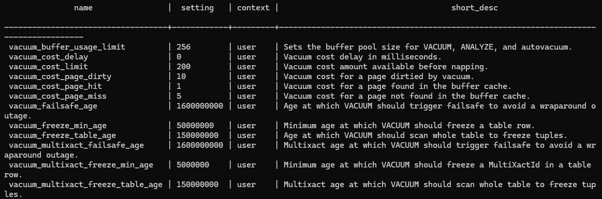
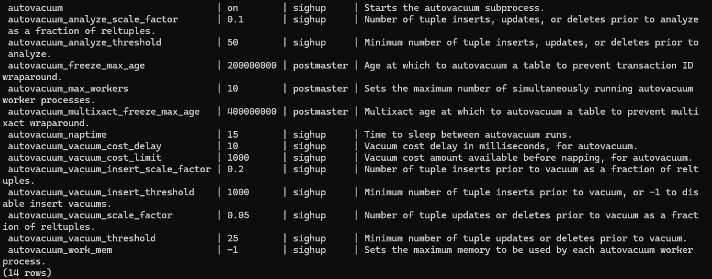

1. подготовка (команды выполняются в windows terminal)

    Создаем docker-сеть: 
docker network create pg-net

    подключаем созданную сеть к контейнеру сервера Postgres:
sudo docker run --name pg-server --network pg-net -e POSTGRES_PASSWORD=postgres -d -p 5432:5432 -v /var/lib/postgres:/var/lib/postgresql/data postgres

2. pgbench
переход в контейнер docker exec -it pg-server bash
инициализация pgbench -i postgres -U postgres
выполнение pgbench -c 8 -P 6 -T 60 -U postgres postgres

результат: 
```
pgbench (16.9 (Debian 16.9-1.pgdg120+1))
starting vacuum...end.
progress: 6.0 s, 448.2 tps, lat 17.674 ms stddev 11.370, 0 failed
progress: 12.0 s, 451.8 tps, lat 17.665 ms stddev 11.118, 0 failed
progress: 18.0 s, 463.2 tps, lat 17.216 ms stddev 10.888, 0 failed
progress: 24.0 s, 462.5 tps, lat 17.243 ms stddev 10.981, 0 failed
progress: 30.0 s, 452.6 tps, lat 17.639 ms stddev 11.393, 0 failed
progress: 36.0 s, 446.9 tps, lat 17.841 ms stddev 11.451, 0 failed
progress: 42.0 s, 464.8 tps, lat 17.176 ms stddev 10.718, 0 failed
progress: 48.0 s, 479.8 tps, lat 16.614 ms stddev 11.051, 0 failed
progress: 54.0 s, 444.8 tps, lat 17.920 ms stddev 11.797, 0 failed
progress: 60.0 s, 454.0 tps, lat 17.599 ms stddev 11.487, 0 failed
transaction type: <builtin: TPC-B (sort of)>
scaling factor: 1
query mode: simple
number of clients: 8
number of threads: 1
maximum number of tries: 1
duration: 60 s
number of transactions actually processed: 27420
number of failed transactions: 0 (0.000%)
latency average = 17.453 ms
latency stddev = 11.232 ms
initial connection time = 29.723 ms
tps = 457.021846 (without initial connection time)
```

3. настройка vacuum/autovacuum
```
изменим значения параметров вручную в файле (целевые показатели): 
vacuum_cost_page_miss= 5
vacuum_cost_page_dirty=10
```

```
изменим значения параметров вручную в файле (целевые показатели): 
autovacuum_max_workers= 10
autovacuum_naptime= 15s
autovacuum_vacuum_threshold= 25
autovacuum_vacuum_scale_factor= 0.05
autovacuum_vacuum_cost_delay= 10
autovacuum_vacuum_cost_limit= 1000
```

после изменения настроек в файле выполнен рестарт контейнера (пояснение: при создании контейнера базовый кластер включен в докер файл и не отображается при выполнении команды pg_lsclusters) 

результат после рестарта: 
vacuum: SELECT name, setting, context, short_desc FROM pg_settings WHERE name like 'vacuum%';


autovacuum: SELECT name, setting, context, short_desc FROM pg_settings WHERE name like 'autovacuum%';


4. pgbench после настройки

```
pgbench (16.9 (Debian 16.9-1.pgdg120+1))
starting vacuum...end.
progress: 6.0 s, 461.5 tps, lat 17.120 ms stddev 10.720, 0 failed
progress: 12.0 s, 448.5 tps, lat 17.795 ms stddev 11.736, 0 failed
progress: 18.0 s, 464.0 tps, lat 17.187 ms stddev 12.268, 0 failed
progress: 24.0 s, 466.3 tps, lat 17.088 ms stddev 12.032, 0 failed
progress: 30.0 s, 479.3 tps, lat 16.648 ms stddev 10.877, 0 failed
progress: 36.0 s, 467.1 tps, lat 17.085 ms stddev 11.909, 0 failed
progress: 42.0 s, 472.2 tps, lat 16.894 ms stddev 11.672, 0 failed
progress: 48.0 s, 466.5 tps, lat 17.108 ms stddev 12.153, 0 failed
progress: 54.0 s, 471.2 tps, lat 16.919 ms stddev 11.719, 0 failed
progress: 60.0 s, 468.5 tps, lat 17.023 ms stddev 11.907, 0 failed
transaction type: <builtin: TPC-B (sort of)>
scaling factor: 1
query mode: simple
number of clients: 8
number of threads: 1
maximum number of tries: 1
duration: 60 s
number of transactions actually processed: 27999
number of failed transactions: 0 (0.000%)
latency average = 17.086 ms
latency stddev = 11.714 ms
initial connection time = 45.348 ms
tps = 466.769750 (without initial connection time)
```

ВЫВОД: после настройки vacuum/autovacuum производительность на примере бенчмарка немного увеличилась - длительность транзакции в 1 секунду (tps) уменьшилась ( в рамках стандартного отклонения можно считать, что осталась на прежнем уровне)

5. Создать таблицу с текстовым полем и заполнить случайными или сгенерированными данным в размере 1млн строк.
```
create table testTable as 
select 
  generate_series(1,1000000) as id,
  md5(random()::text)::char(12) as data;
```
  
размер файла с таблицей: 
```
  SELECT pg_size_pretty(pg_total_relation_size('testTable'));
``` 

```
 pg_size_pretty
----------------
 50 MB
(1 row)
```

6. 5 раз обновить все строчки 
```
update testTable set data = 'testData1';
update testTable set data = 'testData2';
update testTable set data = 'testData3';
update testTable set data = 'testData4';
update testTable set data = 'testData5';
```

количество мертвых строк в таблице: 
```
select c.relname,
current_setting('autovacuum_vacuum_threshold') as av_base_thresh,
current_setting('autovacuum_vacuum_scale_factor') as av_scale_factor,
(current_setting('autovacuum_vacuum_threshold')::int +
(current_setting('autovacuum_vacuum_scale_factor')::float * c.reltuples)) as av_thresh,
s.n_dead_tup
from pg_stat_user_tables s join pg_class c ON s.relname = c.relname
where s.n_dead_tup > (current_setting('autovacuum_vacuum_threshold')::int
+ (current_setting('autovacuum_vacuum_scale_factor')::float * c.reltuples));
```

результат:
``` 
 relname | av_base_thresh | av_scale_factor | av_thresh | n_dead_tup
---------+----------------+-----------------+-----------+------------
(0 rows)
```

7. отлкючить автовакуум на таблице
```
ALTER TABLE testTable SET (autovacuum_enabled = off);
```

5 раз обновить все строчки 
```
update testTable set data = 'testData1';
update testTable set data = 'testData2';
update testTable set data = 'testData3';
update testTable set data = 'testData4';
update testTable set data = 'testData5';
```

мертвые строки: 
```
  relname  | av_base_thresh | av_scale_factor | av_thresh | n_dead_tup
-----------+----------------+-----------------+-----------+------------
 testtable | 25             | 0.05            |     50025 |    4999371
 (1 row)
 ```


Пояснение: 
при включенной настройке автовакуум фоновый процесс автоматически удаляет (vacuum + analyze) устаревшие записи при достижении их порогового значения , указанного в настройках postgres.conf
как видно из результатов запросов, после отключения автоочистки для конкретной таблицы, старые записи остались после всех апдейтов, требуется ручная очистка